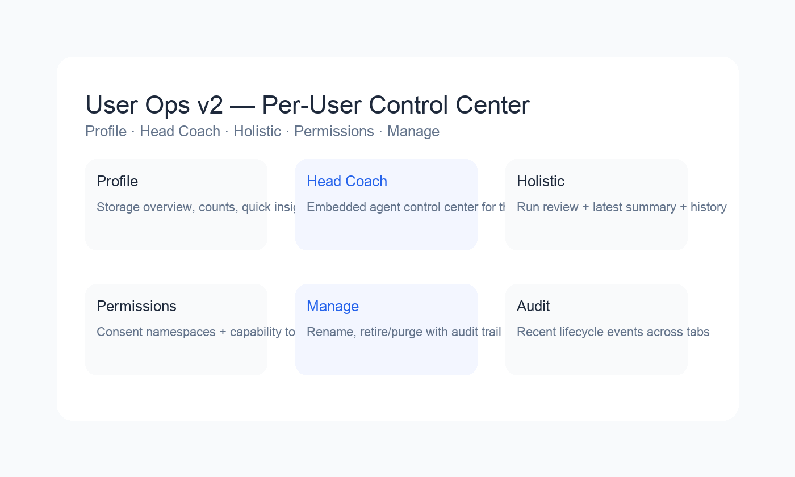

# User Ops v2 — Per-User Control Center

## Overview

Phase 5.A1 introduced per-user controls inside the DevX User Ops surface. The new layout keeps batch operations intact while adding a detail view (`/user-ops/:userId/*`) with dedicated tabs for Head Coach automation, Holistic reviews, consent scopes, and user lifecycle management. Each tab is backed by audited API endpoints and stores its state inside the DevX data tree (`DEVX_DATA_ROOT`).



## Tab Summary

### Profile
- Displays storage footprint, evidence/derived counts, and upcoming analytics stubs.
- Pulls data from `users/<id>` and the new audit helpers.

### Head Coach
- Adds an Agency Level selector (L0–L4) that calls `POST /devx/api/users/{user_id}/agent/configure` to apply bundled presets (policy, schedule, quotas, tokens, and RSC flags).
  - L0 renders a manual Head Coach view with a “Create Background Agent (L1)” call-to-action.
  - L1–L2 re-embed the Agent Control Center with the active autonomy/quotas/schedule reflected immediately.
  - L3 surfaces an RSC collaboration chip; L4 shows workflow toggles (calendar/report/email) as read-only indicators.
  - Downgrades require explicit confirmation and list the pending token revocations/timer cancellations.
- Embeds the Agent Control Center below the selector so operators can continue to run jobs, rotate autonomy, and review mailboxes.
- Shows consent-sensitive scopes as a badge with a quick link to the Permissions tab.


### Holistic
- Queues single-user holistic review jobs (`POST /users/{id}/holistic/run`).
- Shows latest summary (RR, counts, low-RR paths) and the history timeline.
- Supports optional reason strings for audit narratives.

### Permissions
- Namespace permission tree persisted in `permissions/<id>.json` (grants + expiries).
- Lists locally issued capability tokens plus a consent-service mirror when available.
- Issue/Revoke buttons write to `capability_tokens/<id>.json` and call consent revoke.

### Manage (Rename / Retire / Purge)
- Rename updates the user vault, quarantine folders, holistic history, and audit log.
- Retire moves the vault to quarantine, sets grace period, and optionally revokes capabilities.
- Purge enforces grace period checks and permanently removes quarantined data.
- Recent audit entries (rename/retire/purge/permissions) are displayed at the bottom of the tab.

## API Highlights

| Action | Endpoint | Notes |
|--------|----------|-------|
| Queue holistic review | `POST /devx/api/users/{id}/holistic/run` | Generates manifest and audit entry |
| Latest holistic summary | `GET /devx/api/users/{id}/holistic/latest` | Includes history metadata |
| Rename user | `POST /devx/api/users/{id}/rename` | Confirmation string `RENAME OLD TO NEW` |
| Retire/Purge | `DELETE /devx/api/users/{id}` | `mode=retire|purge` with `DELETE ID` or `PURGE ID` confirms |
| Permissions list | `GET /devx/api/users/{id}/permissions` | Combines local + consent capabilities |
| Grant permission | `POST /devx/api/users/{id}/permissions/grant` | Namespaces persisted under `permissions/` |
| Revoke permission/token | `POST /devx/api/users/{id}/permissions/revoke` | Accepts namespace/scope or capability ID |
| Issue capability | `POST /devx/api/users/{id}/capability/issue` | HMAC token with TTL (minutes) |
| Revoke capability | `POST /devx/api/users/{id}/capability/revoke` | Updates local store and hits consent service |
| Audit trail | `GET /devx/api/users/{id}/audit` | Returns most recent JSONL entries |

All endpoints append structured audit events to `devx_jobs/user_ops_audit.jsonl` for replay and compliance checks.

## DevX Capability Helper

Certain DevX routes (Triggers config/tests, Permissions updates, RSC collaboration) require a short-lived capability token. Rather than prompting the operator, the UI now uses a lightweight helper:

- `POST /devx/api/capability/issue` mints a 5–15 minute token for allowlisted scopes (`core.agent.config`, `core.agent.run`, `agents.rsc.send`, `agents.rsc.read`). Requests are gated by the DevX admin header (`x-devx-auth`) and audited as `capability_issued_devx`.
- The frontend caches tokens per user/scope and attaches them via `X-Capability`/`x-agent-capability` headers. If the backend returns `capability_expired|malformed`, the helper re-issues and retries once.
- Manual agents (agency level L0) cannot request execution scopes (`core.agent.run`, `agents.rsc.*`) until they are promoted above L0; configuration scopes remain available for bootstrap.

This keeps privileged DevX flows auditable while avoiding repeated manual minting during operator workflows.

## Verification

```bash
# Single-user holistic run
curl -s -X POST "http://localhost:8100/devx/api/users/USER1/holistic/run" | jq .
curl -s "http://localhost:8100/devx/api/users/USER1/holistic/latest" | jq .

# Rename / retire / purge
curl -s -X POST "http://localhost:8100/devx/api/users/USER1/rename" \
  -H "Content-Type: application/json" -d '{"new_user_id":"USER1A","confirm":"RENAME USER1 TO USER1A"}' | jq .

curl -s -X DELETE "http://localhost:8100/devx/api/users/USER1" \
  -H "Content-Type: application/json" -d '{"mode":"retire","confirm":"DELETE USER1"}' | jq .

curl -s -X DELETE "http://localhost:8100/devx/api/users/USER1" \
  -H "Content-Type: application/json" -d '{"mode":"purge","confirm":"PURGE USER1"}' | jq .

# Permissions & capabilities
curl -s "http://localhost:8100/devx/api/users/USER2/permissions" | jq .

curl -s -X POST "http://localhost:8100/devx/api/users/USER2/permissions/grant" \
  -H "Content-Type: application/json" -d '{"namespace":"SkillDNA","scope":"read"}' | jq .

curl -s -X POST "http://localhost:8100/devx/api/users/USER2/capability/issue" \
  -H "Content-Type: application/json" -d '{"scope":"core.refinement.resolve","ttl_minutes":30}' | jq .

curl -s -X POST "http://localhost:8100/devx/api/users/USER2/capability/revoke" \
  -H "Content-Type: application/json" -d '{"capability_id":"<ID_FROM_ISSUE>"}' | jq .
```

## Tests

`pytest tests/test_user_ops_tabs.py` exercises holistic runs, rename/retire/purge flows, permission management, capability issuance/revocation, batch operations, and audit tail retrieval inside an isolated DevX sandbox.

## Storage Layout

```
DEVX_DATA_ROOT/
  users/<id>/...
  devx_jobs/
    user_ops_audit.jsonl
    holistic/*.json
  holistic/
    <id>.json
    history/<id>_*.json
  permissions/<id>.json
  capability_tokens/<id>.json
  quarantine/<batch>/<id>/...
```

## Navigating between Agents and User Ops

DevX now provides seamless navigation between the Agents panel and per-user settings:

### Breadcrumbs in User Detail
- When viewing a user detail page (`/user-ops/:userId`), a breadcrumb appears at the top: **User Ops › {userId}**
- Click the breadcrumb link to return to the User Ops home page
- A "← All users" button provides an alternate way to navigate back
- Press **Escape** anywhere in User Detail to return to the user list

### Empty States with Deep Links
Both Coach Brain and Narrator Timeline panels now show friendly empty states when no data exists (instead of error banners):

**Coach Brain** (`/coach-brain`):
- When no activation snapshot exists for a user, displays an illustrated empty state
- Includes a "Open Head Coach settings" button that deep-links to `/user-ops/{userId}/hc`
- Helpful message: "Run a Head Coach turn or daemon cycle to generate an activation graph"

**Narrator Timeline** (`/narrator-timeline`):
- When no traces exist, shows a friendly empty state instead of 404 error
- Provides context: "After a Head Coach decision (coach switch, tone shift, curiosity, or Codex action), traces will appear here"
- Includes tip: "Run the HC daemon once to generate a trace"
- Deep-link button to the user's Head Coach tab

### Agent Control → User Ops Link
In the Agent Control panel (`/agent-control`):
- When an agent is selected, a link appears below the agent name: **→ Open Head Coach settings for {USER_ID}**
- Clicking this link navigates to `/user-ops/{USER_ID}/hc`
- Allows quick access to configure the selected agent's background automation settings

### Route Helpers
The frontend now uses centralized route helpers (`src/lib/routes.ts`) to prevent navigation typos:
```typescript
import { userOpsHome, userOpsHC } from '@/lib/routes'

// Navigate to User Ops home
navigate(userOpsHome())

// Deep-link to a user's Head Coach tab
navigate(userOpsHC('USER1'))
```

## Notes

- Consent service calls are stubbed in tests; production uses the live service recorded in `consent/consent_port.log`.
- Capability tokens use the same signing secret as the Agentic Head Coach daemon (`generate_token` helper).
- All destructive operations are double-confirmed and append audit entries for forensic replay.
