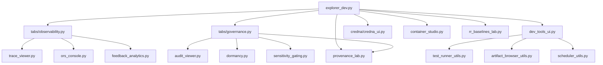

# Developer Explorer Architecture

**Version:** 2.0 (Streamlined)
**Last Updated:** 2025-10-04

---

## 🏗️ System Overview

Developer Explorer is a Streamlit-based internal console for ReDNA system development, testing, and operations. It provides specialized tools for managing coaches, editing traits, observing system behavior, and enforcing governance protocols.

**Primary Users:** Developers, analysts, system operators
**Technology Stack:** Python 3.9+, Streamlit, Pandas, Altair (optional), requests

---

## 📐 Architecture Principles

### 1. Modular Tab System
Each major functional area is isolated into a separate tab module under `ExplorerDev/tabs/`:
- `observability.py` — Traces, logs, service health, feedback analytics, testing
- `governance.py` — Audit logs, dormancy, sensitivity gating, provenance

### 2. Write-Protect Context
All modules receive a `WriteProtectContext` that enforces:
- **Write-protect ON**: Changes isolated to `data/dev_users/` and `persona_config/dev_overrides/`
- **Write-protect OFF**: Changes apply directly to live storage

### 3. Fallback Handling
Navigation includes fallback logic for missing dependencies:
```python
try:
    from ExplorerDev.tabs.observability import render_observability_tab
    render_observability_tab(context)
except ImportError:
    st.error("Unable to load Observability tab")
    _show_diagnostics(context)  # Fallback to legacy view
```

### 4. Separation of Concerns
Each section has a distinct, non-overlapping purpose:
- **Coach Workshop**: Persona management only
- **Observability**: Diagnostics and analytics only
- **Governance**: Audit and compliance only
- **Developer Tools**: Testing and utilities only

---

## 🗂️ Directory Structure

```
ExplorerDev/
├── explorer_dev.py                     # Main entry point, navigation
├── tabs/
│   ├── __init__.py                     # Tab module registry
│   ├── observability.py                # Unified observability tab
│   └── governance.py                   # Governance & audit tab
├── dev_tools_ui.py                     # Developer Tools (enhanced)
├── ors_console.py                      # ORS Console components (reused)
├── audit_viewer.py                     # Audit log viewer (reused)
├── trace_viewer.py                     # Trace waterfall renderer (reused)
├── trace_consolidation.py              # Trace schema unification (reused)
├── credna/
│   └── credna_ui.py                    # CReDNA Studio (existing)
├── container_studio.py                 # Container Studio (existing)
├── rr_baselines_lab.py                 # RR Baselines Lab (existing)
├── provenance_lab.py                   # Provenance Explorer (existing)
└── [other utilities]                   # Bootstrap, schema, diag utils, etc.

ReDNACoreDemo/core/
├── feedback_analytics.py               # Backend for Feedback Analytics tab
├── dormancy.py                         # Backend for Dormancy Management tab
└── sensitivity_gating.py               # Backend for Sensitivity Gating tab
```

---

## 🔌 Module Dependency Graph



---

## 📊 Data Flow

### Observability Tab → Trace Viewer

```
User enters trace_id
    ↓
tabs/observability.py → render_trace_waterfall(trace_id)
    ↓
trace_viewer.py loads trace logs from:
    - data/dev_logs/trace_dev_explorer.jsonl
    - data/dev_logs/trace_ucnrr.jsonl
    - data/dev_logs/trace_core.jsonl
    ↓
trace_consolidation.py consolidates logs by trace_id
    ↓
trace_viewer.py renders waterfall HTML/CSS
    ↓
Streamlit displays visualization
```

### Governance Tab → Audit Logs

```
User selects log type (e.g., RR_BASELINES)
    ↓
tabs/governance.py → render_rr_baselines_audit(limit=50)
    ↓
audit_viewer.py loads audit log from:
    - data/audit_logs/rr_baselines_audit.jsonl
    ↓
Parse JSONL, extract before/after diffs
    ↓
Streamlit displays expandable entries with rollback buttons
```

### Developer Tools → System Settings

```
User views Holistic Scheduler settings
    ↓
dev_tools_ui.py → _render_holistic_scheduler_settings(context)
    ↓
scheduler_utils.py loads preferences from:
    - data/dev_ops_schedule.json (write-protect ON)
    - data/ops_schedule.json (write-protect OFF)
    ↓
Display current state (enabled, cadence_hours, last_run)
    ↓
User edits and saves → scheduler_utils.save_scheduler_prefs()
    ↓
Backup created (.bak file)
    ↓
New preferences saved
```

---

## 🔐 Security & Safety

### Write-Protect Enforcement

**Environment Variable:** `WRITE_PROTECT` (default: `true`)

**Behavior:**
```python
class WriteProtectContext(Protocol):
    write_protect: bool

if context.write_protect:
    # Isolated paths
    user_data_path = Path("data/dev_users/")
    config_path = Path("persona_config/dev_overrides/")
else:
    # Live paths
    user_data_path = Path("data/users/")
    config_path = Path("persona_config/")
```

**Enforcement Points:**
- All `save_*` functions check `context.write_protect`
- Rollback operations disabled when `write_protect=True`
- Heir transfer operations blocked when `write_protect=True`
- Audit log writes go to dev paths when `write_protect=True`

### Rollback Safety

Before any rollback operation:
1. Check current user is not modifying another user's commit
2. Verify change has not been pushed (git status check)
3. Validate `.bak` file exists and is recent
4. Require explicit confirmation
5. Create backup of current state before rollback

---

## 🧩 Integration Points

### 1. ReDNA Core API
**Used by:** Observability → Loop Test, Feedback Analytics
**Endpoints:**
- `/ingest_text` — Ingest text for UCN/RR computation
- `/curiosity` — Fetch live curiosity data
- `/feedback/planning_weights` — Get planning weights

### 2. ExplorerFinal Nudge Store
**Used by:** Observability → Feedback Analytics, Testing
**Functions:**
- `nudge_store.load_feedback_aggregates()` — Get feedback scores
- `nudge_store.add_bundle()` — Enqueue nudge (for golden path test)
- `nudge_store.accept()` — Accept nudge
- `nudge_store.undo()` — Undo nudge action

### 3. Head Coach Ops
**Used by:** Governance → Audit Logs
**Audit Trail:**
- `data/audit_logs/head_coach_ops_audit.jsonl`
- Tracks scheduler operations, batch actions, config changes

### 4. Persona Registry
**Used by:** Coach Workshop
**Source:** `ReDNACoreDemo.core.persona_registry`
**Functions:**
- `dump_registry_snapshot()` — Export persona registry
- `get_persona()` — Fetch individual persona
- `list_personas()` — List all registered personas

---

## 🎨 UI/UX Design Patterns

### Expandable Entries
Used for: Audit logs, trace events, transfer history
```python
for idx, entry in enumerate(entries):
    with st.expander(f"Entry {idx + 1} — {entry.get('timestamp')}"):
        st.json(entry)
```

### Color-Coded Tables
Used for: Lifecycle states, consent records, planning weights
```python
def color_state(val: str) -> str:
    if val == "active":
        return "background-color: #d4edda"  # Green
    elif val == "deceased":
        return "background-color: #f8d7da"  # Red
    return ""

styled_df = df.style.applymap(color_state, subset=["State"])
st.dataframe(styled_df, use_container_width=True)
```

### Auto-Refresh Pattern
Used for: Log tailer
```python
auto_refresh = st.checkbox("Auto-refresh (5s)", value=False)
if auto_refresh:
    last_tick = st.session_state.get("_log_tick", 0.0)
    now = time.time()
    if now - last_tick > 5.0:
        st.session_state["_log_tick"] = now
        st.rerun()
```

### Waterfall Visualization
Used for: Trace Viewer
```html
<div style="position:relative; width:100%; height:40px; background:#f0f0f0;">
    <div style="position:absolute; left:{start_pct}%; width:{width_pct}%;
                background:{color}; height:100%; display:flex; align-items:center;
                padding-left:5px; color:white; font-size:0.8rem;">
        {duration_ms:.1f}ms
    </div>
</div>
```

---

## 🔄 Session State Management

Developer Explorer uses Streamlit session state for:

| Key | Purpose | Scope |
|-----|---------|-------|
| `_nav_section` | Current navigation section | Global |
| `_trace_view_mode` | Trace viewer mode (search/details) | Observability tab |
| `_selected_trace_id` | Currently selected trace ID | Observability tab |
| `_feedback_user` | User for feedback analytics | Observability tab |
| `_consent_user` | User for consent records | Governance tab |
| `_ors_ping_results` | Cached service ping results | Observability tab |
| `_log_content_{source}` | Cached log content | Observability tab |
| `LIVE_USER_KEY` | Live mode user ID | Coach Workshop |
| `SELECTED_CONTAINER_KEY` | Selected container | Container Studio |
| `SELECTED_TRAIT_KEY` | Selected trait | Container Studio |

**Best Practice:** Prefix session state keys with `_` for tab-specific state to avoid collisions.

---

## 🧪 Testing Strategy

### Unit Tests
**Location:** `ExplorerDev/tests/`
**Coverage:**
- `test_rr_baseline_utils.py` — RR baseline operations
- `test_credna_ops.py` — CReDNA operations
- `test_bootstrap_imports.py` — Import validation

### Integration Tests
**Location:** `scripts/`
**Key Tests:**
- `golden_path_test.py` — End-to-end nudge workflow
- `run_tests.sh` — Full test suite runner

### UI Testing
**Method:** Manual testing via Dev Explorer tabs
**Checklist:**
1. Navigate to each of 7 sections
2. Test write-protect mode (ON and OFF)
3. Verify trace viewer with sample trace
4. Check audit log rendering
5. Test feedback analytics with real user
6. Verify system settings display

---

## 📈 Performance Considerations

### Lazy Loading
Tabs are only imported when navigated to:
```python
try:
    from ExplorerDev.tabs.observability import render_observability_tab
    render_observability_tab(context)
except ImportError:
    st.error("Unable to load tab")
```

### Caching
Use `@st.cache_data` for expensive operations:
```python
@st.cache_data(ttl=5.0)
def fetch_ucnrr_health(core_base: str) -> Dict[str, Any]:
    response = requests.get(f"{core_base}/ui/ucnrr/health")
    return response.json()
```

### Pagination
Limit displayed entries for large datasets:
```python
display_artifacts = artifacts[:50]  # Show first 50
if len(artifacts) > 50:
    st.info(f"Showing first 50 of {len(artifacts)}. Use search to narrow.")
```

---

## 🚀 Deployment

### Local Development
```bash
# Set environment variables
export WRITE_PROTECT=true
export CORE_BASE=http://localhost:8015

# Launch Dev Explorer
streamlit run ExplorerDev/explorer_dev.py --server.port 8502
```

### Production Deployment
```bash
# Use write-protect OFF for production ops
export WRITE_PROTECT=false
export CORE_BASE=https://core.redna.example.com

# Launch with custom config
streamlit run ExplorerDev/explorer_dev.py --server.port 8502 \
  --server.headless true \
  --browser.serverAddress localhost
```

### Docker Deployment
```dockerfile
FROM python:3.9-slim

WORKDIR /app
COPY requirements.txt .
RUN pip install -r requirements.txt

COPY . .

ENV WRITE_PROTECT=true
ENV CORE_BASE=http://core:8015

EXPOSE 8502
CMD ["streamlit", "run", "ExplorerDev/explorer_dev.py", "--server.port", "8502"]
```

---

## 🔧 Extending Dev Explorer

### Adding a New Tab

1. **Create tab module:** `ExplorerDev/tabs/my_new_tab.py`
```python
def render_my_new_tab(context: WriteProtectContext) -> None:
    st.subheader("My New Tab")
    st.caption("Description of what this tab does")

    # Tab implementation
    if not context.write_protect:
        # Write operations
        pass
```

2. **Update `tabs/__init__.py`:**
```python
from ExplorerDev.tabs.my_new_tab import render_my_new_tab
__all__.append("render_my_new_tab")
```

3. **Update navigation in `explorer_dev.py`:**
```python
section_options.extend([
    "My New Tab",
])

# ...

elif section == "My New Tab":
    from ExplorerDev.tabs.my_new_tab import render_my_new_tab
    render_my_new_tab(DEV_WRITE_CONTEXT)
```

### Adding a Sub-Tab

Within an existing tab module:
```python
def render_my_tab(context: WriteProtectContext) -> None:
    tab1, tab2, tab3 = st.tabs(["Sub-Tab 1", "Sub-Tab 2", "Sub-Tab 3"])

    with tab1:
        _render_subtab_1(context)

    with tab2:
        _render_subtab_2(context)

    with tab3:
        _render_subtab_3(context)
```

---

## 📚 Related Documentation

- [Dev_Explorer_Guide.md](Dev_Explorer_Guide.md) — User guide with workflows
- [Dev_Explorer_Audit.md](Dev_Explorer_Audit.md) — Redesign analysis
- [Overnight_Batch_3_Dev_Explorer_Rework.md](Overnight_Batch_3_Dev_Explorer_Rework.md) — Implementation summary
- [Testing_Guide.md](Testing_Guide.md) — Testing infrastructure
- [Rollback_Procedures.md](Rollback_Procedures.md) — Rollback paths

---

## 🆘 Troubleshooting

### Import Errors
**Symptom:** `Unable to load Observability tab: ModuleNotFoundError`
**Solution:** Check `ExplorerDev/tabs/__init__.py` imports and ensure all dependencies are installed

### Write-Protect Issues
**Symptom:** Changes not persisting or wrong paths being written
**Solution:** Verify `WRITE_PROTECT` environment variable and restart Streamlit

### Trace Viewer Empty
**Symptom:** "No trace records matched filters"
**Solution:** Check ORS logs exist in `data/dev_logs/trace_*.jsonl` and trace ID format

### Session State Conflicts
**Symptom:** Tab state bleeding across sections
**Solution:** Prefix session state keys with `_` and tab name (e.g., `_obs_trace_id`)

---

**Version History:**
- **2.0** (2025-10-04): Streamlined architecture with 7 sections, tab modules
- **1.0** (2025-09-28): Initial monolithic architecture with 9+ sections
